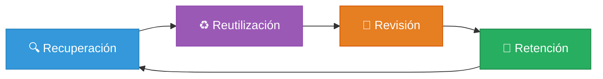
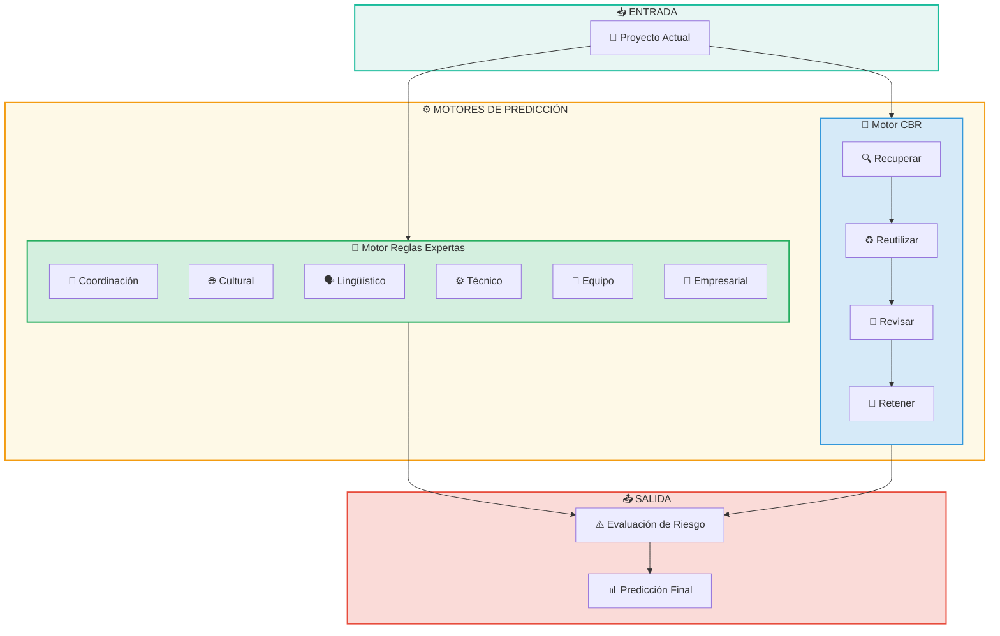

# Motores de Predicción de Riesgos

## Diagrama de Arquitectura

```mermaid
block-beta
    columns 3
    
    PROJECT["🎯 PROYECTO"] --> ENGINE1
    PROJECT --> ENGINE2
    
    block:ENGINE1["🔧 MOTOR 1: REGLAS EXPERTAS"]:2
        direction TB
        
        block:COORD["📅 Coordinación"]
            C1["🌍 Solapamiento Horario"]
            C2["💬 Herramientas Comunicación"]
            C3["👥 Fragmentación Equipos"]
        end
        
        block:CULTURAL["🌐 Cultural"]
            CU1["📊 Distancia Hofstede"]
            CU2["PDI, IDV, MAS"]
            CU3["UAI, LTO, IND"]
            CU4["40 países"]
        end
        
        block:LING["🗣️ Lingüístico"]
            L1["📝 Distancia Lingüística"]
            L2["🌍 Idiomas Oficiales"]
        end
        
        block:TECH["⚙️ Técnico"]
            T1["📈 Brecha Habilidades"]
            T2["🖥️ Infraestructura"]
            T3["✅ Calidad"]
        end
        
        block:TEAM["👥 Equipo"]
            TE1["⚡ Sobrecarga"]
            TE2["🎓 Experiencia"]
            TE3["🧠 BFI-44 Personalidad"]
        end
        
        block:BIZ["🏢 Empresarial"]
            B1["🏠 Modalidad Trabajo"]
            B2["🔄 Remoto/Híbrido"]
        end
    end
    
    block:ENGINE2["🤖 MOTOR 2: CBR (Case-Based Reasoning)"]:1
        direction TB
        
        block:CBR_PHASES["📚 Ciclo CBR"]
            direction TB
            R1["🔍 RECUPERACIÓN"]
            R2["♻️ REUTILIZACIÓN"]
            R3["📝 REVISIÓN"]
            R4["💾 RETENCIÓN"]
            R1 --> R2
            R2 --> R3
            R3 --> R4
            R4 --> R1
        end
        
        block:SIMILARITY["📊 Métricas de Similitud"]
            S1["💻 Tecnologías"]
            S2["👥 Tamaño Equipo"]
            S3["📅 Duración Proyecto"]
            S4["🌍 Distribución Geográfica"]
            S5["🌐 Características Culturales"]
            S6["🗣️ Características Lingüísticas"]
        end
        
        block:CASES["📦 Base de Casos"]
            CA1["📁 Casos Históricos"]
            CA2["📈 Ordenados por Similitud"]
            CA3["🎯 Selección Relevantes"]
        end
    end
    
    ENGINE1 --> RISK["⚠️ EVALUACIÓN DE RIESGO"]
    ENGINE2 --> RISK
    RISK --> OUTPUT["📊 PREDICCIÓN FINAL"]

    style PROJECT fill:#4a90d9,stroke:#333,stroke-width:2px,color:#fff
    style ENGINE1 fill:#e8f4f8,stroke:#2980b9,stroke-width:2px
    style ENGINE2 fill:#fef9e7,stroke:#f39c12,stroke-width:2px
    style RISK fill:#fadbd8,stroke:#e74c3c,stroke-width:2px
    style OUTPUT fill:#d5f5e3,stroke:#27ae60,stroke-width:2px,color:#333
```

## Descripción de los Motores

### Motor 1: Reglas Expertas 📋

El primer motor implementado se basa en **reglas expertas** diseñadas a partir de:
- 📚 Literatura científica
- 👩‍💼 Revisión de experta en gestión de proyectos de software remoto/híbrido

#### Factores Evaluados:

| Factor | Descripción | Métricas |
|--------|-------------|----------|
| **Coordinación** | Sincronización del equipo | Solapamiento horario, herramientas síncronas/asíncronas, fragmentación |
| **Cultural** | Distancia entre culturas | Dimensiones de Hofstede (PDI, IDV, MAS, UAI, LTO, IND) - 40 países |
| **Lingüístico** | Barreras de idioma | Distancia lingüística basada en idiomas oficiales |
| **Técnico** | Capacidades técnicas | Brecha de habilidades, infraestructura, calidad |
| **Equipo** | Características del equipo | Sobrecarga, experiencia, personalidad (BFI-44) |
| **Empresarial** | Contexto organizacional | Modalidad de trabajo (remoto/híbrido/presencial) |

### Motor 2: CBR (Case-Based Reasoning) 🤖

El segundo motor utiliza **aprendizaje basado en casos** con un ciclo de cuatro fases:

#### Fases del Ciclo CBR:

1. **🔍 Recuperación**: Búsqueda de proyectos similares en la base de casos históricos
2. **♻️ Reutilización**: Adaptación de soluciones de casos similares al proyecto actual
3. **📝 Revisión**: Validación y ajuste de la solución propuesta
4. **💾 Retención**: Almacenamiento del nuevo caso para uso futuro

#### Métricas de Similitud:

- 💻 Tecnologías utilizadas
- 👥 Tamaño del equipo
- 📅 Duración del proyecto
- 🌍 Distribución geográfica
- 🌐 Características culturales
- 🗣️ Características lingüísticas

---

## Diagrama Simplificado de Flujo

